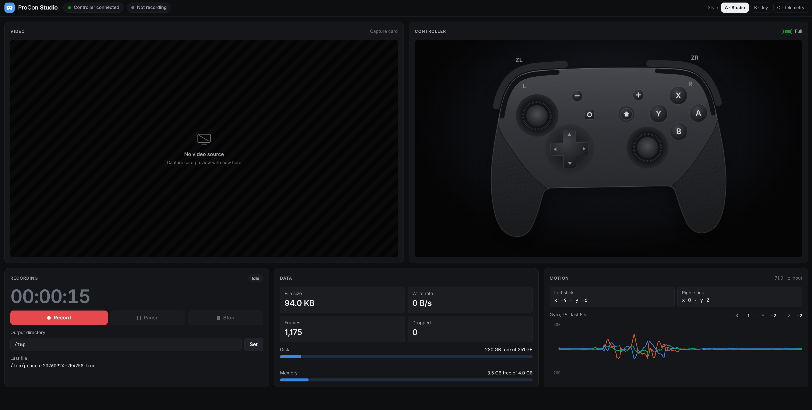

# ProCon Studio

Records Nintendo Switch gameplay for training datasets: every Pro Controller
report, timestamped, next to the console's video and sound.

A Raspberry Pi 4 sits between the Pro Controller and the Switch as a USB proxy
and streams the controller's reports over the network. A Linux PC with a
capture card records them with the video, and its web dashboard has four apps:
**Studio**, to watch and record; **Inkspector**, to check recorded sessions
frame by frame and label objects on them; **Cuttlefish**, to review videos with
comments, drawings and an AI coach, and to manage its knowledge; and
**Vision**, to detect and track objects in recorded sessions.

> [!TIP]
> **[See the setup guide and dashboard tour →](https://htmlpreview.github.io/?https://github.com/Grizzco-Lab/procon-rs/blob/main/doc/index.html)**
>
> The hardware you need, how it is wired, and what the studio does, with
> screenshots. Source: [doc/index.html](doc/index.html).



## How it fits together

```
Pro Controller ──USB──> Raspberry Pi 4 (procon-proxy) ──USB gadget──> Nintendo Switch
                              │ TCP :7331 frames, :7332 replay
                              v
Switch HDMI ──capture card──> Linux PC (procon) ──> dashboard :8090
                                         └──> <prefix>YYYY-MM-DD_HH-MM-SS/
```

- **`procon-proxy`** (on the Pi): presents itself to the Switch as a wired Pro
  Controller and forwards reports both ways (input to the Switch; rumble, LEDs
  and subcommands to the controller). Each input report is stamped with the
  Pi's clock and a sequence number and streamed to the studio on
  `[stream] port`, with a heartbeat each second while the controller is quiet.
  Actions sent to its `[replay] port` replace (or mix with) the controller's.
- **`procon`** (on the PC): the studio. Connects to the proxy, captures video
  and sound with ffmpeg, serves the dashboard and records sessions.
- **`crates/gameplay-data`**: the recording format and the per-frame alignment
  of controller input to video, shared with the training code through Python
  bindings.

## Requirements

- Raspberry Pi 4 (or another Linux board with a USB device controller), with
  USB gadget support
- Nintendo Switch or Switch 2, docked, and a wired Pro Controller
- A Linux PC with `ffmpeg` and a capture card (tested with the Elgato 4K X); an
  NVIDIA GPU for the default NVENC encoders, or libx264 (see `config.toml`).
  PulseAudio for recording sound
- Rust (stable; `rust-toolchain.toml` adds the `aarch64-unknown-linux-musl`
  target)

## Quick start

Everything runs from the PC.

1. Deploy the proxy. This cross-compiles `procon-proxy` as a static binary,
   copies it with `proxy.toml` to `~/procon` on the Pi and restarts it there
   (it needs `sudo` on the Pi for the USB gadget):

   ```bash
   ./scripts/deploy.sh [ssh-host]   # default host: pi4
   ```

   To build on the Pi instead, run `./scripts/run-proxy.sh` there.

2. Set the proxy's address in `config.toml` (`[proxy] address` and
   `replay_address`), then start the studio:

   ```bash
   ./scripts/run.sh
   ```

3. Open `http://<pc>:8090`.

Without a Pi, `cargo run --example fake_proxy [port]` streams a synthetic
controller; point `[proxy] address` at `localhost:7331`.

## The dashboard

One page with four apps, switched without reloading: **Studio** (`#studio`),
**Inkspector** (`#inspect`), **Cuttlefish** (`#cuttlefish`) and **Vision**
(`#vision`). The app links sit in a left rail or in the top bar; the
connection, controller, proxy latency and recording chips stay in the top bar
in every app. The **View** menu picks the theme (Studio, Joy or
Telemetry), the Phone layout (also used automatically on narrow screens) and
where the app links go (Side rail or Top bar); the choices are remembered per
browser. Capture and recording carry on while another app is shown; only the
Studio's preview pauses, and each app stops its own work while hidden.

### Studio

- **Video**: the capture card, the screen or no video. The live preview is
  low-latency H.264 played by the browser, with its delay shown next to the
  title; **Inputs** draws the sticks, pressed buttons and turn rates over it,
  delayed to match the picture. A capture card can only be opened by one
  program, so close OBS first.
- **Controller**: a 3D Pro Controller (three.js from a CDN; a flat drawing
  without WebGL) with the battery level. **Splatoon mode** tracks the
  controller's real pose from the gyro and accelerometer, Y recenters it, and
  the sensitivity slider (-5 to +5) scales the motion from 1/4x to 4x.
- **Recording**: Record, Pause and Stop; the path prefix; the recorded size
  (1080p to 360p) and frame rate (60 to 10 fps); "Preview at recording
  quality"; "Record sound"; and the game's settings (Splatoon 3 motion and
  stick sensitivity, motion controls, invert Y/X), saved with each session.
- **Replay**: plays a session folder, a `controller.bin` or a `.jsonl` of
  actions to the Switch (see below).
- **Data**: controller and video write rates, this session's size, all
  sessions in the save folder, dropped frames, free disk space (with the time
  left at the current rate) and free memory.
- **Motion**: stick readouts and a five-second gyro chart.

The path prefix, video input, quality, sound, game settings and replay file
are saved in `config.state.json` next to the config, so they survive restarts.

### Inkspector

Checks recorded sessions frame by frame: whether the controller labels line up
with the picture, and a model's predictions against them.

- **Sessions**: every session under `[inspect] root` (by default the recording
  prefix's folder) with its start, duration, segments, video size and rate,
  sound, reports, game settings and video delay.
- **A segment**: the frame at 360p with its labels drawn over it (Overlay:
  Full, Minimal or None), a scrubber, play/pause at 0.25x to 1x with the
  segment's sound, the three frames on each side, and a table of their labels
  (buttons, sticks, gyro degrees over the frame). Keys: Space play/pause, ←/→
  one frame (Shift: ten), R a random frame where a button changes or the gyro
  turns (Shift+R: any), G go to a frame number or time.
- **Delay**: the `video_delay_ms` box starts at the session's delay from the
  calibration file (`[inspect] calibration`, AgentZero's `calibration.json`),
  shown with its source: set by hand, measured from the session (high or
  medium confidence), or, failing both, the delay of its setup. Change the box
  to check the alignment by eye; **Save as this session's delay** writes it to
  the calibration file as set by hand, and **Remove** goes back to the
  computed one.
- **Predictions**: a labels `.jsonl` path on the PC shows a model's labels
  under the truth, differences in red.
- **Label** (L): draw boxes around objects on the frame, class by class, for
  training a detector. Boxes are saved per frame in `[inspect] annotations`
  (default `Annotations` next to the sessions' folder); the model's boxes
  (from Vision) are dashed until accepted or corrected.
- The URL keeps the view (`#inspect/s=<session>&seg=<file>&n=<frame>&delay=<ms>`).

Labels come from `crates/gameplay-data`, the same code the training side uses.

### Cuttlefish

Reviews a video (a recorded segment, a video file on the PC or a range of a
YouTube video) with comments at its times and shapes drawn on the paused frame;
reviews are saved in `[cuttlefish] reviews`. **Ask Cuttlefish** sends the
range's frames and nearby comments to Claude with knowledge from the store and
adds its comments. The **Knowledge** tab (top bar) shows and fills that store
(`crates/cuttlefish`, folder `[cuttlefish] knowledge`):

- what it holds: documents per kind of source, chunks, glossary, digest, and
  whether `ANTHROPIC_API_KEY` and `DISCORD_BOT_TOKEN` are set (never their
  values);
- **Search**: the nearest chunks with their source, link, license and score,
  in any language, without a key;
- **Ask** and **Translate**: need `ANTHROPIC_API_KEY` in the studio's
  environment (the only place it is read from);
- **Import**: web pages, a sitemap or a MediaWiki category (robots.txt obeyed,
  one request per site every few seconds), YouTube subtitles, files on the PC
  (markdown, text, HTML, PDF), a Discord export or a Discord bot; one import at
  a time, with its log and a Cancel button;
- the documents, and a glossary lookup.

The embedding model (about 470 MB) is downloaded into the knowledge folder the
first time the store opens.

### Vision

Detects and tracks objects in a recorded segment (`crates/gameplay-vision`,
YOLOv8 in candle):

- **Detect**: a session, segment and range (first frame, every n-th frame,
  count; 300 frames every 2nd by default), the pretrained COCO model in size
  n, s or m or your own weights (`[vision] weights`), with tracking. One run
  at a time, on its own thread, with progress, the device, and per-frame
  decode, network and total times (mean and 95th percentile); Cancel keeps the
  frames done. The model loads once and is reused.
- **Results**: the frames with their boxes (class color, score, track id), a
  scrubber (←/→), a table per class, the tracks and their paths on screen.
  The last results of each segment are kept in `[vision] results` (default
  `Vision` next to the sessions' folder) and shown again when reopened.
- **Send to labels**: writes the results into the labels as model boxes,
  renaming classes (`person=player`) and leaving out classes `classes.json`
  does not have. Frames a person has labeled are never changed. A link opens
  the frame in the Inkspector's Label mode.

COCO models know nothing of Salmon Run (Salmonids come out as `bowl`, `boat`
or nothing); the app is the workflow for our own weights. On a 16-core CPU a
frame takes about 130 ms (n), 250 ms (s) and 470 ms (m); build with
`--features cuda` for the GPU.

## Recordings

A session is a folder named from the path prefix and the start time: prefix
`/data/procon/mk8-` records into `/data/procon/mk8-2026-09-24_21-40-05/`. The
prefix's folder must exist.

| File | Contents |
|---|---|
| `controller.bin` | 80-byte frames, little endian: Unix ms on the Pi (u64), report size (u8, 0 for a heartbeat), sequence number (u32), µs from the proxy reading the report to the Switch taking it (u16, 0 if unknown), 1 padding byte, the 64-byte HID report |
| `video-01.mkv`, `video-02.mkv`, … | One file per stretch between pauses: constant-rate H.264 with a keyframe every second, plus an Opus sound track (48 kHz stereo) when "Record sound" is on |
| `session.json` | Start/stop times, the proxy's address and clock offset, frame and dropped-frame counts, the video input, size and frame rate, each file's first-frame time (`start_unix_ms`, and `audio_start_unix_ms` with sound) and `game_settings` |

To line them up on the PC's clock:

- Frame `n` of a video file was captured at its `start_unix_ms` plus
  `n / video.fps` seconds. `start_unix_ms` is when the capture card delivered
  the first frame to the kernel, not when it reached the studio.
- A controller frame's time is its timestamp plus `proxy.clock_offset_ms`
  (the smallest PC-minus-Pi difference seen over 10 s, so it includes the
  shortest network delay).
- The game itself takes time from input to picture: the frame at video time
  `t` shows the input from `t - video_delay_ms`. That delay differs per setup
  and session; AgentZero measures it into `calibration.json`, and the
  Inkspector shows and edits it.
- The sound track starts with the first frame (shifted by
  `[video] audio_offset_ms`), so both tracks start at 0 in the file.

`gameplay-data` implements all of this (`align::constant_rate_times`,
`align::align`), in Rust and Python.

### Replaying actions

To see what a model does, play actions to the Switch from the Replay panel:
load a session folder, a `controller.bin` or a `.jsonl`, then Play. The studio
sends them to the proxy's replay port; while it plays, the Switch gets the
replayed input instead of the controller's (and that is what gets recorded),
and the controller takes over again on Stop or at the end. "Mix with the
controller" combines the two instead: buttons pressed on either count, and each
stick and the gyro take whichever moves more.

A `.jsonl` file has one action per line:

```json
{"t_ms": 40, "buttons": ["zr"], "left_stick": [2048, 3500], "right_stick": [1200, 2048], "gyro": [0, -300, 12]}
```

Fields left out keep the controller's own values. Sticks are raw 12-bit
(center ≈ 2048), `gyro`/`accel` raw IMU units; see `src/replay.rs`. A model
can also connect to the replay port itself and stream lines (without `t_ms`)
as it predicts them.

## Configuration

Both programs take `--config <path>`.

`config.toml` (studio, on the PC):

| Section | Sets |
|---|---|
| `[proxy]` | `address` (the Pi's stream port) and `replay_address` (its replay port) |
| `[web]` | Dashboard `port` |
| `[recording]` | Default path `prefix` until one is set on the dashboard |
| `[video]` | First `input` (`"screen"`, `/dev/video0` or `""`), capture `fps`, `v4l2_args`, recorded size and rate, ffmpeg `encoder` and `preview_encoder` options, `audio_input` (a PulseAudio source, `pactl list short sources`) and `audio_offset_ms` |
| `[inspect]` | Optional: the Inkspector's `root` (folder of session folders), `calibration` (default `../AgentZero/calibration.json`) and `annotations` (object labels, default `Annotations` next to the root); relative paths start at the config's folder |
| `[cuttlefish]` | Optional: `reviews` (default `Reviews` next to the root), `cache` (YouTube downloads), `knowledge` (the knowledge store, default `$CUTTLEFISH_DATA` or `~/.local/share/cuttlefish`) and `model` |
| `[vision]` | Optional: `results` (default `Vision` next to the root), `size` (COCO model first chosen: `n`, `s` or `m`), `weights` + `classes` + `weights_size` (your own model) and `confidence` (0.25) |
| `[logging]` | `level`: error, warn, info, debug or trace |

`proxy.toml` (USB proxy, on the Pi):

| Section | Sets |
|---|---|
| `[proxy]` | `hidg_retry_delay_ms`: wait before reopening the HID gadget |
| `[dump]` | `autostart` a local backup session from launch until exit, at `prefix` |
| `[stream]` | `port` the studio connects to for frames (7331) |
| `[replay]` | `port` for JSON-line actions (7332) |
| `[performance]` | `enable_cpu_affinity`: pin the proxy to one CPU core |
| `[logging]` | `level` |

## Troubleshooting

- **"Failed to setup USB gadget"**: run the proxy as root (`sudo`).
- **"No USB device controller found"**: the board's USB port is not in device
  (gadget) mode; check that the kernel supports USB gadgets.
- **"Pro Controller not found"**: check the USB cable and permissions. The proxy
  waits for the controller as long as it takes.
- **"No controller input" although the console responds to the controller**:
  the controller is talking to the console over Bluetooth (it does this once it
  has been plugged into the console itself). The proxy resets it at start to
  force USB; if it happens while running, replug it and restart the proxy.
- **No video**: a capture card can only be opened by one program; close OBS.
- **Switch asleep**: the proxy logs "Switch stopped taking input" once and
  drops reports until it wakes. Home then signals USB remote wakeup
  (`src/wake.rs`). The Switch 2 ignores it, as it does a Pro Controller plugged
  in directly: wake it with its power button or a wireless controller. The
  original Switch may accept it (untested).

## Contributing

See [CONTRIBUTING.md](CONTRIBUTING.md) for the code layout, how the pieces fit,
development commands and conventions.
