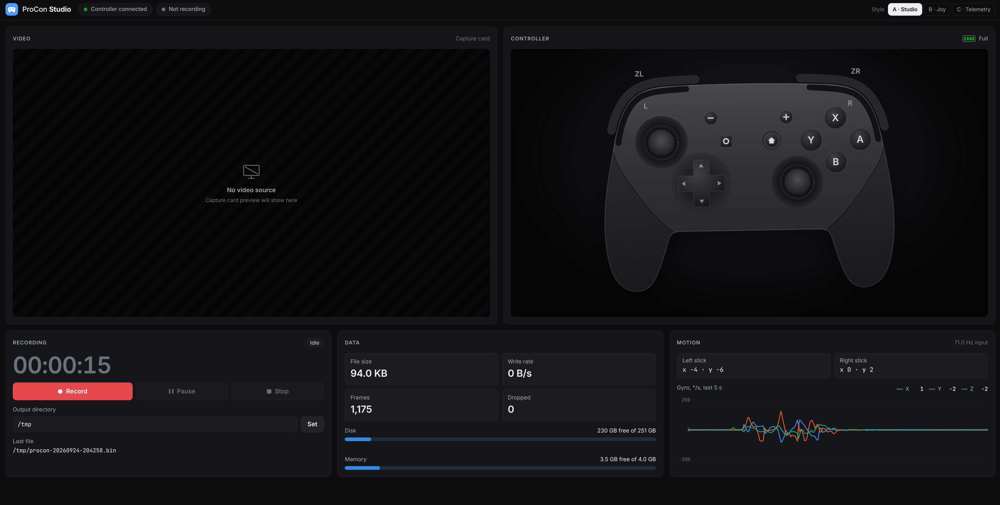

# ProCon Studio

Records Nintendo Switch gameplay for training datasets: every Pro Controller
report, timestamped, next to the console's video and sound.

A Raspberry Pi 4 sits between the Pro Controller and the Switch as a USB proxy
and streams the controller's reports over the network. A Linux PC with a
capture card records them with the video, and its web dashboard has five apps:
**Studio**, to watch and record; **Inkspector**, to check recorded sessions
frame by frame and label objects on them; **Cuttlefish**, to review videos with
comments, drawings and an AI coach, and to manage its knowledge; **Vision**,
to detect and track objects in recorded sessions; and **Predictor**, to see
what the inverse dynamics model reads off any video.

> [!TIP]
> **[See the setup guide and dashboard tour →](https://htmlpreview.github.io/?https://github.com/Grizzco-Lab/procon-rs/blob/main/doc/index.html)**
>
> The hardware you need, how it is wired, and what the studio does, with
> screenshots. Source: [doc/index.html](doc/index.html).



## How it fits together

```
Pro Controller ──USB──> Raspberry Pi 4 (procon-proxy) ──USB gadget──> Nintendo Switch
                              │ TCP :7331 frames, :7332 replay
                              v
Switch HDMI ──capture card──> Linux PC (procon) ──> dashboard :8090
                                         └──> <prefix>YYYY-MM-DD_HH-MM-SS/
```

- **`procon-proxy`** (on the Pi): presents itself to the Switch as a wired Pro
  Controller and forwards reports both ways (input to the Switch; rumble, LEDs
  and subcommands to the controller). Each input report is stamped with the
  Pi's clock and a sequence number and streamed to the studio on
  `[stream] port`, with a heartbeat each second while the controller is quiet.
  Actions sent to its `[replay] port` replace (or mix with) the controller's.
- **`procon`** (on the PC): the studio. Connects to the proxy, captures video
  and sound with ffmpeg, serves the dashboard and records sessions.
- **`crates/gameplay-data`**: the recording format and the per-frame alignment
  of controller input to video, shared with the training code through Python
  bindings.

## Requirements

- Raspberry Pi 4 (or another Linux board with a USB device controller), with
  USB gadget support
- Nintendo Switch or Switch 2, docked, and a wired Pro Controller
- A Linux PC with `ffmpeg` and a capture card (tested with the Elgato 4K X); an
  NVIDIA GPU for the default NVENC encoders, or libx264 (see `config.toml`).
  PulseAudio for recording sound
- Rust (stable; `rust-toolchain.toml` adds the `aarch64-unknown-linux-musl`
  target)

## Quick start

Everything runs from the PC.

1. Deploy the proxy. This cross-compiles `procon-proxy` as a static binary,
   copies it with `proxy.toml` to `~/procon` on the Pi and restarts it there
   (it needs `sudo` on the Pi for the USB gadget):

   ```bash
   ./scripts/deploy.sh [ssh-host]   # default host: pi4
   ```

   To build on the Pi instead, run `./scripts/run-proxy.sh` there.

2. Set the proxy's address in `config.toml` (`[proxy] address` and
   `replay_address`), then start the studio:

   ```bash
   ./scripts/run.sh
   ```

   It builds the studio first (`cargo run --release`): after an update of the
   code that takes about 15–45 s, after a change of dependencies or a
   toolchain update over a minute; the dashboard answers once it is built.

3. Open `http://<pc>:8090`.

Without a Pi, `cargo run --example fake_proxy [port]` streams a synthetic
controller; point `[proxy] address` at `localhost:7331`.

## The dashboard

One page with five apps, switched without reloading: **Studio** (`/studio`,
also `/`), **Inkspector** (`/inspect`), **Cuttlefish** (`/cuttlefish`),
**Vision** (`/vision`) and **Predictor** (`/predictor`). Each app keeps what is
open in the URL, so a link opens it again, a reload stays where it was, and the
browser's back and forward move between views; an app keeps its place while
another is shown. Links from before (`#inspect/...`) still open. The URLs:

| App | URL |
| --- | --- |
| Studio | `/studio` |
| Inkspector | `/inspect`, `/inspect/<session>?seg=<file>&n=<frame>&delay=<ms>&pred=<path>` (`&label=1` opens the labeling mode) |
| Cuttlefish | `/cuttlefish` (reviews), `/cuttlefish/translate`, `/cuttlefish/knowledge`, `/cuttlefish/review/<id>?t=<s>`, `/cuttlefish/video?kind=&ref=&start_s=&end_s=&t=` (a video not reviewed yet) |
| Vision | `/vision`, `/vision/<session>?seg=<file>&n=<frame>` |
| Predictor | `/predictor`, `/predictor/<video>/<checkpoint>?t=<s>` |

The apps form one pipeline: the Studio captures data (recordings), the
Inkspector inspects and labels them frame by frame (labels), Cuttlefish
reviews videos, translates slang across languages and keeps the Overfishing
Pedia (reviews and knowledge), Vision detects objects toward 3D
reconstruction (detections), and the Predictor predicts controller actions
(IDM predictions, which go back to the Inkspector next to the labels). The
guide **How it fits together** draws this pipeline with a link to each app;
it opens by itself on a first visit and again from the **?** button or the
View menu.

The app links sit in a left rail
(with the guide, the language switch and View at its foot; compact by default,
each app's name and what it is for as tooltips, or expanded to icons with both
through the View menu or the chevron at its foot) or in the top bar (what each
app is for as a tooltip); drag them, or press Alt+arrows on
one, to reorder them. The proxy, controller, proxy
latency and recording indicators stay in the top bar in every app (hover one
for details). The **View** menu picks the theme (Studio, Joy, Telemetry or
Salmon Run), the layout (Auto, or Phone, which narrow screens also use),
where the app links go (Side rail or Top bar), the rail's width (Compact or
Expanded) and the language (English or
Simplified Chinese, by default the browser's; so far the app names, status and View menu, and Cuttlefish with its
Translate, Knowledge and Pedia views, are translated); the choices are remembered per browser. Capture and recording carry on while another app is shown; only the
Studio's preview pauses, and each app stops its own work while hidden.

### Studio

- **Video**: the capture card, the screen or no video. The live preview is
  low-latency H.264 played by the browser, with its delay shown next to the
  title; **Inputs** draws the sticks, pressed buttons and turn rates over it,
  delayed to match the picture. A capture card can only be opened by one
  program, so close OBS first.
- **Controller**: a 3D Pro Controller (three.js from a CDN; a flat drawing
  without WebGL) with the battery level. **Splatoon mode** tracks the
  controller's real pose from the gyro and accelerometer, Y recenters it, and
  the sensitivity slider (-5 to +5) scales the motion from 1/4x to 4x.
- **Recording**: Record, Pause and Stop; the path prefix; the recorded size
  (1080p to 360p) and frame rate (60 to 10 fps); "Preview at recording
  quality"; "Record sound"; and the game's settings (Splatoon 3 motion and
  stick sensitivity, motion controls, invert Y/X), saved with each session.
- **Techniques**: technique markers, labelled examples of what you practise
  (squid roll, sub strafe / inertia cancel, main strafe, fast wall climb,
  small hop / big jump, grabbing eggs without cancelling ink recovery, egg
  throw, egg runs at the basket, and any you add). Pick one (keys 1–9), then
  while recording mark a span with **Start span** / **Stop span** (M), or
  **Mark last** N seconds (B); **Undo** (U) removes the last marker (or drops
  the open span). Starting another technique ends the open span; Pause and
  Stop end it too. **This session** counts the reps marked so far;
  **Checklist** shows which techniques have examples in any session under
  the Inkspector's root. Added techniques (name, Chinese name, Pedia term
  id) are saved in `config.state.json`; each has a link to its Pedia entry.
- **Replay**: plays a session folder, a `controller.bin` or a `.jsonl` of
  actions to the Switch (see below).
- **Data**: controller and video write rates, this session's size, all
  sessions in the save folder, dropped frames, free disk space (with the time
  left at the current rate) and free memory.
- **Motion**: stick readouts and a five-second gyro chart.

The path prefix, video input, quality, sound, game settings, replay file and
added techniques are saved in `config.state.json` next to the config, so they
survive restarts.

### The player

The Inkspector, Cuttlefish, Vision and Predictor show video in the same
player: ▶ Play, ‹ Frame and Frame ›, speed 0.25x to 2x, Sound (the segment's
or the video's), the overlay (Full, Minimal or None, where there are
controller labels), Go to… and the position (frame and time); a scrubber with
marks (labeled frames, processed frames, comments; a click near a mark goes
to it) and the neighbours strip, updated while paused. Keys everywhere: Space
play/pause, ←/→ one frame (Shift: ten), Home/End, G go to a frame number or
time (12.5s, 1:02.5); they never scroll the page. Recorded sessions show
exact frames decoded by the studio; other videos play in the browser.

### Inkspector

Checks recorded sessions frame by frame: whether the controller labels line up
with the picture, and a model's predictions against them.

- **Sessions**: every session under `[inspect] root` (by default the recording
  prefix's folder) with its start, duration, segments, video size and rate,
  sound, reports, game settings and video delay.
- **A segment**: the frame at 360p in the player (see below) with its labels
  drawn over it (Overlay: Full, Minimal or None; with a predictions file the
  Full overlay shows the prediction against the truth), the segment's sound,
  the three frames on each side right under it, and beside it a table of
  their labels (buttons, sticks, gyro degrees over the frame; truth over
  prediction, mismatches in red). R goes to a random frame where a button changes or the gyro turns
  (Shift+R: any frame).
- **Delay**: the `video_delay_ms` box starts at the session's delay from the
  calibration file (`[inspect] calibration`, AgentZero's `calibration.json`),
  shown with its source: set by hand, measured from the session (high or
  medium confidence), or, failing both, the delay of its setup. Change the box
  to check the alignment by eye; **Save as this session's delay** writes it to
  the calibration file as set by hand, and **Remove** goes back to the
  computed one.
- **Predictions**: a labels `.jsonl` path on the PC shows a model's labels
  under the truth, differences in red.
- **Technique markers**: the session's markers are red bands on the
  scrubber with labelled chips under it (a click goes to the start), and a
  list in the Session panel: change a marker's technique, its first and last
  frame (typed, or **Start here** / **End here** at the frame shown),
  **Go** to it or **Delete** it. **Add marker here** adds one after the fact
  (2 s from the frame shown, the technique picked in the Studio). Markers
  cover controller input, so they are drawn at the delay in use.
- **Label** (L): draw boxes around objects on the frame, class by class, for
  training a detector. Boxes are saved per frame in `[inspect] annotations`
  (default `Annotations` next to the sessions' folder); the model's boxes
  (from Vision) are dashed until accepted or corrected. Keys 1–9, 0 and
  Shift+1…0 pick the first twenty classes; `/` finds any class by typing
  (Enter picks the first match). Labeled frames are marked on the progress
  bar (full ticks: labeled by you; short ticks: model boxes only), also
  outside the Label mode, fainter; a click next to a mark goes to its frame.
- **Follow** (F, in the Label mode): the selected box, or all of the frame's,
  is tracked over the next 0.5–10 s (forward, backward or both ways) by SAM 2
  and written as dashed model boxes with a score and one track id per
  object. Step through with →, accept with A, fix a box that drifted and
  Follow again from there: the new boxes replace that object's model boxes.
  Frames you labeled are never overwritten (a Follow stops before the first
  one), and an object the tracker loses is not followed further. The tracker
  is AgentZero's local service: start it with `cd ../AgentZero && uv run
  agentzero-track-serve` (port 7340, `[inspect] tracker`), or with **Start
  tracker** on the page. It uses the GPU when it has room, else the CPU,
  and says which: about 35 ms per frame for one object on an RTX 4070 SUPER
  (+20 ms per extra object), 1.2–2 s on the CPU. Fast camera turns, ink and
  name tags make boxes drift within a few frames for players and small
  Salmonids; golden eggs and baskets hold for seconds.
- The URL keeps the view (`/inspect/<session>?seg=<file>&n=<frame>&delay=<ms>`).

Labels come from `crates/gameplay-data`, the same code the training side uses.

### Cuttlefish

A chat with Cuttlefish, the AI reviewer, and video reviews: a recorded
segment, a video file on the PC or a range of a YouTube video with comments at
its times and shapes drawn on the paused frame, a notebook of mistakes and
lessons to flip through later. The app has four views, **Reviews**,
**Translate**, **Knowledge** and **Pedia**; Cuttlefish's avatar sits next to every box
where he can be asked.

**Reviews** is the entry: the reviews so far, **Open a video** (a session, a
file, a YouTube range), and at the bottom **Ask Cuttlefish**, a chat bar.
Typing there (a question about one's play: the examples, "Why did I go down
here?", "Where did the egg flow break?", rotate as its placeholder and sit
above it as chips) starts a new review without a video, opens it and sends
the message. Inside a review the chat is the panel beside the video (the main
area when there is no video, with **Attach a video** beside it: a session, a
file, or a YouTube range downloaded into the review); with a video its chips
start with the moment (**Comment on this moment**, **What goes wrong in this
range?**). The chat keeps its whole history; Cuttlefish's answers cite the
knowledge (`[S1]`, listed under **Sources**) and name moments as times that
seek the video when clicked, and when asked about the video they can add
timed comments with drawings, linked from the answer. **With the video**
chooses what a message takes along: the frames around the playhead (**this
moment**), a **range**, or **no frames**; **Comment on this moment** sends a
review request for the playhead. Beside the choice, the page estimates the
image tokens the message will send (about width × height / 750 per frame):

- **this moment**: 15 frames from 4 s before to 2 s after the playhead, five a
  second within ±1 s of it and one a second further out, each captioned with
  how far it is from the moment;
- **a range** (at most 100 s): frames at the rate and height picked beside the
  times (1 fps and 480p by default), placed where the picture changes (a
  cheap frame difference) and around wave starts and ends when the video has
  a wave table, fewer in calm stretches. A range longer than 20 s takes two
  calls: a sparse overview (0.5 fps, 360p) in which Cuttlefish picks up to
  five key moments with reasons, then sharper frames around those (five per
  moment, at the height picked) with the answer.

Frames are never upscaled (at most the video's own height; 720p for a moment),
JPEG at ffmpeg quality 3, and cached on disk per video, time and height
(`~/.cache/procon-cuttlefish/frames/`, never cleaned up by itself), so asking
again about the same moment extracts nothing. They open the conversation, so
with the API a follow-up about the same moment reads them from the prompt
cache; the Claude Code CLI places its own cache breakpoints, and only its
system prompt is read back from the cache. Every message is saved in the review's
`review.json` (`messages`, with role, text, the moment or range it was asked
with, sources and time), so reopening the review shows the conversation. The
chat needs a model backend: `ANTHROPIC_API_KEY` in the studio's environment
(the only place it is read from), or the Claude Code CLI (below); without one
the chat says so and messages, comments and drawings are still saved.

Among the chips are a few **deep questions** at random, marked with a dot:
questions a high-level player asks, whose answers the community knows ("Why
do the first kills of a wave need to be so aggressive when we lure bosses
to the basket anyway?", "Which way does the Drizzler jump, and when?"; the
bank is `crates/cuttlefish/questions/deep.toml`, in English and Chinese).
Every answer of Cuttlefish has **Correct / add to memory** (纠正/补充 →
存为笔记): it opens an editor with the question and the answer, which you
edit into the correct explanation and save as an **expert note**, a
Markdown file in `notes/` of the knowledge folder that Cuttlefish trusts
over every other source from then on (notes are retrieved first and
labelled "Expert note (user), <date>" under **Sources**). The Knowledge
view lists the notes (**Expert notes**: edit, delete) and the bank (**Deep
questions**), and runs the **deep eval**: the model answers the questions
that need no video, a few at a time; you mark each answer **Good** or
**Wrong** and turn a wrong one into a note with **Correct → note**. That is
how the memory grows. When a chat is about a video without a controller
recording, the input it reasons from is the Predictor's estimate, and the
prompt says so with the model's measured reliability, so Cuttlefish does
not build fine claims on it.

**Translate** is the translator, a chat-like page for jargon and callouts: a
box at the bottom with a target language (English, 中文, 日本語, Español,
Français, Русский, 한국어; the last choice is remembered), the player's own
sentences as chips (惯性取消搬蛋快, 我还剩一个镭射, …) and two English
callouts into Chinese. A whole sentence comes back translated in the names the
other community uses, with a **Copy** button and the glossary terms it used
(熊刷 → Grizzco Roller, 出差 → shore run, each with its definition and its
names in the other languages). A bare term (Steelhead, コジャケ, 熊刷) shows
its glossary entry at once, its name in the target language as the
translation, and then Cuttlefish's short explanation of what it means and
when a player says it. The glossary answers without a key; the model's
translation and explanation need the model backend, and the page says so
when there is none. Every answer is kept in
`<reviews>/translations.jsonl` (one JSON object per line, the last 500),
shown again on the next visit; **Clear history** removes the file.

The glossary keeps each term's **official names** per language (stat.ink's
translations once imported; for Chinese, the official Simplified Chinese
names: 金鲑鱼, 鲑坝, 喇叭镭射5.1ch, 熊先生印章滚筒) apart from its
**slang**: aliases players use (熊刷, 鬼坝, 破船, 喇叭, 小绿, 蛋筐's 筐 and
家里, …), each with its language and a note on its origin. Slang is found in
sentences and looked up like a name, the term card lists it ("zh slang"), and
the model is told "熊刷 → 熊先生印章滚筒 (en: Grizzco Roller)" and to say
when it is unsure what a slang word means. You teach it on the page:

- **Add alias** on a term card: the alias, its language and a note.
- **Teach a word** under a sentence: select the slang word in the text (or
  type it), search the term it means in any language, and save; the
  sentence's terms are looked up again.
- **Slang** (the button in the panel's head, with the number of suggestions
  waiting) opens the list of what you taught, to edit or delete, and the
  suggestions to **Approve**, **Reject** or **Edit**.
- **Suggest slang from the knowledge base** first tells what a run would
  read (community documents not read yet, in batches of about 12,000
  characters: how many batches in all, and how many this run reads, 5 by
  default, at most 50; or tick **Read everything not read yet** for all the
  batches, three sent at once), then, on **Run**, has the model read them
  and propose aliases with a quote as evidence and a confidence. Proposals
  the text does not contain, names the glossary knows and terms it lacks
  are dropped, and a rejected one is not proposed again. The run shows in
  the Knowledge view's jobs too and can be stopped there or here; it ends
  with a tally (aliases applied, new terms, pending, skipped), and the next
  run continues where it stopped.
- **Apply confident suggestions** (on by default, `[cuttlefish]
  slang_auto_apply`): proposals the model is at least 60% sure of
  (`slang_threshold`) are approved at once, marked **auto-applied**; the
  rest wait for review. **Auto-applied** above the approved list shows only
  those, each with **Undo** (it is rejected and never proposed again).
- **New terms**: when players name something narrower than any glossary
  term (a Flyfish's missiles are not the Flyfish), the model proposes a new
  term instead of an alias: an English name ("Flyfish missiles"), what it is,
  a definition, how it relates to an existing term ("part of Flyfish") and
  its aliases (missiles, FF missiles). New terms join the glossary like
  imported ones; the prompts show `missiles → Flyfish missiles (part of
  Flyfish)`. Approve, reject, undo or delete them in the panel.
- **Better terms for old aliases**: an alias approved for a broader term
  whose text a new term now claims (missiles of the Flyfish) is listed with
  **Move** (or **Move all**), which gives it to the new term.
- **Edit definition / relation** on a term card (and **Edit** on a new term
  in the panel): correct a term's definition, or how it relates to a
  broader term (part of, a kind of, related to, picking the term as you
  type). A new term changes in place, and its name and kind too; a term of
  the glossary keeps its names, and your definition and relation are kept
  as an override in `glossary-user.toml` (listed under **Edited glossary
  terms**, with **Restore the glossary's**), so imports never lose them.

What you teach and approve is kept in `<knowledge>/glossary-user.toml`,
apart from the generated glossary, so re-importing name tables never
overwrites it. `cuttlefish slang suggest --all` (with `--backend
claude-cli`, `--parallel`, `--no-auto-apply`, `--dry-run`) and `cuttlefish
slang move` do the same from the command line.

`./scripts/run.sh` loads secrets from an env file, so the key never goes on
the command line or into a config file: `$PROCON_ENV` if set, else
`~/.config/procon/env`, else a git-ignored `.env` in the repository. One
`KEY=value` per line; variables already set in the shell win.

```bash
mkdir -p ~/.config/procon
printf 'ANTHROPIC_API_KEY=%s\n' 'sk-ant-...' > ~/.config/procon/env
chmod 600 ~/.config/procon/env
```

Without a key, the studio can run the locally installed **Claude Code CLI**
instead (`[cuttlefish] backend`: `auto` by default takes the API when the key
is set, else `claude` on PATH; `api` or `claude-cli` force one). It runs
`claude -p` headless with the same prompt, no tools and an empty working
folder, on the account the CLI is logged in with: the answers use your Claude
subscription and count against its usage limits. It is meant for personal
testing on your own machine. The Knowledge view shows which backend answers
(API, Claude subscription (CLI) or none), never a key. `model` names the
chat's model, `translate_model` the translator's; unset, each backend uses its
own default.

Each review is a folder in `[cuttlefish] reviews`, `<id>/review.json`, with
its video when the video belongs to it: a YouTube range is downloaded straight
into its review (with the video's title, channel and upload date, shown in the
library), and a local file can be copied in with **Copy into review**. A
recorded session is never copied; its review points at the recording. Deleting
a review deletes its folder, video included, after a confirmation. Reviews
saved before this layout (`<id>.json`) move into folders when the studio
starts, and a YouTube video still in `~/.cache/procon-cuttlefish` moves into
its review. A YouTube review without its title (such as one moved from the old
layout) gets the title, channel and upload date in the background the first
time it is listed or opened; the title in the library, the review's header and
the top bar links to the original video on YouTube, at the playhead in the
review.

While reviewing:

- **Danmaku** (D) shows comments over the video as playback reaches them,
  with their drawings, for a few seconds: floating in the bottom-right corner
  or sliding across the picture;
- **Neighbours**: the player's strip every 0.5 s (0.25–2 s) around the
  playhead, updated while paused, with dots for the comments near each; a
  click seeks there, a dot opens its comment; the comments are marks on the
  scrubber too (hover one for its text, click to open it);
- **Notes**, under the video: comments on the whole video, at no time
  (general notes, rants), which can be edited and deleted.

The chat sends the message, the conversation so far, the frames it takes along
and the nearby comments to Claude with knowledge retrieved from the store for
it. About a moment it also sends the moment as text: the HUD (wave, timer and
golden eggs, when the video has a wave table), the controller input (recorded
for a session, else the Predictor's latest prediction for the video, as an
estimate) and the objects labelled on that frame; and with the knowledge come
the closest **expert comments**, single #vod-review comments of high-level
players about similar moments ("Centritide, 2023 (S3), about a W2 :50
moment"), listed under the answer as **Expert comments given** with links to
Discord. The Knowledge view's **Create reviews from #vod-review** indexes
them (`cuttlefish corpus index` does it alone).

**Pedia** (Overfishing Pedia, 乱获百科; the fourth tab, `/cuttlefish/pedia`)
turns the glossary into an encyclopedia of Salmon Run for new players. The
index groups the Salmon Run terms in sections (movement techniques, bosses
and Salmonids with their parts and attacks, King Salmonids, special events
and tides, egg flow, roles and strategy, weapons, stages, modes and
mechanics), with a search in any language (slang included: *sub strafe*
finds inertia cancel, 熊刷 the Grizzco Roller), filters by game (S3, S2) and
by source (official names, community slang and terms, yours), and A–Z or
**Most discussed** (how many #vod-review comments mention the term or its
slang). An entry (`/cuttlefish/pedia/<term id>`) has the official names in
every language, the slang with its language and origin, the definition,
related terms both ways (part of, a kind of, related to), the stat.ink icon
or the class icon, game-data fact cards when imported, **In the wild** (the
best #vod-review comments using the term, with reviewer, date and era;
**Conversation** shows the whole comment with its replies, and a comment on
a VOD that is a review here opens it at its moment), **Recorded examples**
(the technique markers of your sessions with the term's id or name, each
opening the Inkspector at its start; shown for movement techniques and any
term that has some), the expert notes and deep questions about it, and
**Ask Cuttlefish about this**. Everything is
corrected in place: **Edit** the definition and kind, add or remove slang,
**Link to a term**, **Flag as wrong** (a term the suggestions added is
rejected, with Undo; a glossary term is corrected), **Add a note**. Edits are
yours in `glossary-user.toml` (overrides of glossary terms, which imports
never change) and the chat and the translator use them at once.

Wherever an answer cites a source (`[S1]`, the sources and expert comments
listed under it) or the Pedia quotes a comment, a click opens it in the
page: a #vod-review comment in full with the message it answers, the replies
and the moments it names (each opening the community review there), a wiki,
guide, game-data or expert-note chunk with its title, section, licence and
credit. Discord and the original page stay as small links.

The **Knowledge** view (the third tab above the library) manages that
store (`crates/cuttlefish`, folder `[cuttlefish] knowledge`) and nothing else:
asking is the chat's job, translating and looking up the glossary the
Translate view's. It is laid out in two columns, feeding and searching on the
left, what is there on the right:

- **Import**: the **Inbox** (below), web pages (every tab of a Google Sheet
  if asked), a sitemap, **Wiki / site**: a MediaWiki topic (start pages and
  categories with their subcategories, a depth limit; a re-run fetches only
  changed pages) or a whole site on its own host (a page cap), each with a
  dry run that counts the pages first (robots.txt obeyed, one request per
  site every few seconds), YouTube subtitles, files on the PC (markdown, text, HTML, PDF, Word, subtitles),
  a Discord export or a Discord bot; one import at a time, with its log and a
  Cancel button;
- **Search**, the nearest chunks with their source, link, license and score,
  in any language, without a key (what the chat retrieves);
- **What the store holds**: documents, chunks, glossary and digest counts,
  which model backend answers (the API or the Claude CLI; never a key's
  value) and whether `DISCORD_BOT_TOKEN` is set, then documents by source and format, glossary terms by language
  and the name tables they came from, assets by folder, the inbox and the
  last imports with their reports; **Documents** (each can be deleted) and
  **Assets**, a browser of the imported images and icons with the names of
  the weapon or boss they show.

**Where to put things.** The knowledge folder is `Knowledge` next to the
Inkspector's root (with the data on Dropbox,
`/home/cjr/DropboxRemote/SalmonRun/Knowledge`), or `[cuttlefish] knowledge`.
Drop anything into its `inbox/` folder, as it is: guides, whole projects or
git repositories, zip files, spreadsheets, icon folders. Or use the Inbox in
the Import panel: drag files or folders onto it or pick them, optionally into
a named folder of the inbox (up to 4 GB a file). Then press **Import inbox**
(or run `cuttlefish ingest inbox`). Files stay in the inbox; nothing is moved
or deleted.

**How it is digested.** Each file is looked at by its name and first bytes:

| What you drop | What it becomes |
|---|---|
| Guides and notes: markdown, text, HTML, PDF, Word `.docx`, subtitles `.srt`/`.vtt` | Documents, split into chunks and embedded for search and the AI |
| Name tables: JSON, YAML, TOML, CSV, TSV, `.po`, `.properties`, locale folders (`locales/ja/…`, `USen.json`, `JPja.json`, …) | Glossary terms: the same key in several languages (weapon, stage, boss names) with the language codes, where each came from, and joined to the glossary's own terms when a name matches. Never embedded. Huge interface-text dumps keep only keys that name things |
| Data tables without several languages (weapon stats, …) | A small text document (`key / path: value` lines) when under 1 MB; bigger ones are skipped with the reason. Project configuration (`package.json`, `Cargo.toml`, …) is skipped |
| Source code, a git repository, a zip of one | The code is skipped; its README, docs and string and locale files are read as above. `node_modules`, build output, `.git` and binaries are never entered |
| Images and icons (PNG, JPEG, GIF, WebP, SVG, …) | Assets: size, a thumbnail, a name from the file name, and the glossary term it shows when the file name says (`Wst_Shooter_Normal_00.png` → Splattershot) |
| Zip and tar archives | Unpacked (in the local cache) and taken the same way |
| DiscordChatExporter JSON | Its conversations |
| Anything else (video, Excel, fonts, programs, unknown formats) | Skipped, with the reason in the report |

Two limits to know: Excel (`.xlsx`) and Nintendo's own formats (`.msbt`,
`.bin`, `.sarc`, …) are not read (save a sheet as CSV; datamined text usually
exists as JSON too). And an image is linked to a glossary term by the end of
its file name, so `sockeye-station-low-tide.jpg` links to "Low Tide", not to
the stage.

Every import writes a report (taken as what, skipped and why, failed, gone
from the inbox). Files are remembered by content: importing again does
nothing for unchanged files, a changed file replaces its document or table,
and a copy of a file already there is skipped.

The knowledge folder may be synced (Dropbox, rclone): the store writes whole
files through a rename, locks nothing, and skips files that arrive half-synced
or as conflict copies; documents synced in from another machine are embedded
when the store next loads. The embedding model (about 470 MB), thumbnails and
unpacked archives stay on this machine, in `~/.cache/procon-cuttlefish`.

The store of before lived in `~/.local/share/cuttlefish`, a folder another
program (with its own `~/.cache/cuttlefish`) uses too. When the studio starts,
only our entries there (`docs/`, `index/`, `raw/`, the glossary, `models/`, …)
are handled: their data is copied into the knowledge folder and checked, then
they are moved into `~/.local/share/cuttlefish/procon-migrated-<date>.safe-to-delete/`
(the Knowledge tab shows where). That folder can be deleted; the other
program's files are never touched. The CLI `cuttlefish` finds the same
knowledge folder through the studio's `config.toml` (`--config`, else
`./config.toml`), else `$CUTTLEFISH_DATA`.

### Vision

Detects and tracks objects in a recorded segment (`crates/gameplay-vision`,
YOLOv8 in candle):

- **Detect**: a session, segment and range (first frame, every n-th frame,
  count; 300 frames every 2nd by default), the pretrained COCO model in size
  n, s or m or your own weights (`[vision] weights`), with tracking. One run
  at a time, on its own thread, with progress, the device, and per-frame
  decode, network and total times (mean and 95th percentile); Cancel keeps the
  frames done. The model loads once and is reused.
- **Results**: the segment in the player with the boxes (class color, score,
  track id) over the processed frames, which are marks on the scrubber
  (**‹ Boxes** / **Boxes ›**, P/N, jump between them) and a table per class.
- **Tracks**: the tracks drawn over the frame at the playhead, each a short
  trail (±2 s, fading with time, colored by class, with its id). Selecting a
  track in the table jumps to its first frame, draws its whole path and its
  box over its middle frame, and shows its boxes as small crops (a click goes
  to that frame), so you see what it followed. Trails are positions on the
  screen: the camera keeps turning, so they are not places on the stage; map
  positions need camera localisation, which is planned. Beside them, the
  stage (from a Cuttlefish review of the segment, or picked there) with
  Gungee's top-down map of it at a tide, for reference, and links to his 2D
  and 3D viewers (see **Stage maps** below).
  Only our classes are shown (those of `classes.json`, after the renames such
  as `person=player`), with their names and colors; the note says how many
  other boxes are hidden. **Experimental: show all COCO classes** shows the
  detector's own classes instead. The last results of each segment are kept
  in `[vision] results` (default `Vision` next to the sessions' folder) and
  shown again when reopened.
- **Classes**, **Dataset** (the default): every class of `classes.json` with
  its boxes drawn by people and by models across the annotations, each
  labeled segment (a link opens it in the Label mode), and the frames labeled
  so far against about 200, which the Salmon Run detector needs. **This
  run**: the classes of the results on screen, and **Send to labels**, which
  writes them into the labels as model boxes (renamed; classes `classes.json`
  does not have are left out). Frames a person has labeled are never changed.
  A link opens the frame in the Inkspector's Label mode.

**Salmon Run detector (AgentZero)** in the model list is our own detector
(D-FINE-S trained on the frames labeled in the Inkspector, see AgentZero's
README), served by AgentZero's `agentzero-detect-serve` (port 7341,
`[vision] detector`). Choosing it shows a card with its state: when it does
not answer, the command to start it and **Start detector**, which runs
`[vision] detector_command` (default `uv run agentzero-detect-serve --port
<port>`) in `detector_dir` (default `../AgentZero`) and stops it with the
studio; the service needs a trained checkpoint (`runs/detect/best`, from
`agentzero-detect train`). Once it answers: the checkpoint, its mAP50 on
held-out frames, the frames it was trained on, when it was saved, the device
and GPU memory free. Until about 200 frames are labeled a warning says the
model is weak, with a link to the labeling progress (the **Dataset** view,
the count `agentzero-detect status` gives). A run goes through the service,
which decodes the video itself and picks the GPU when it has room (**CPU**
forces the CPU); its boxes and times stream into the same progress, timings,
results, tracks and **Send to labels** as a YOLO run. One request at a time:
a second one (say, `agentzero-detect predict` from a shell) is refused as
busy. A run on the GPU is refused while a session is being recorded.

COCO models know nothing of Salmon Run (Salmonids come out as `bowl`, `boat`
or nothing), hence our classes only; the app is the workflow for our own
weights. On a 16-core CPU a frame takes about 130 ms (n), 250 ms (s) and
470 ms (m); build with `--features cuda` for the GPU.

#### Stage maps

The Salmon Run stage maps come from **Gungee**'s free community tools,
[salmon-learn-nw.gungee.jp](https://salmon-learn-nw.gungee.jp/maplist/): a
2D viewer for every stage and a
[3D one](https://salmon-learn-nw.gungee.jp/maplist3d/) for Gone Fission
Hydroplant, Marooner's Bay and Jammin' Salmon Junction. Thank you, Gungee!
A Cuttlefish review has a stage picker in its header (saved as `stage` in
`review.json`; a YouTube title naming the stage fills it in until one is
picked), with **Map by Gungee: 2D ↗ 3D ↗** links that open his viewers in
a new tab. Vision, the Inkspector's Session card and the Predictor show the
same links when a review of the video names the stage. Vision also shows his
top-down picture of the stage, credited under it; the studio fetches each
picture once, when first shown, into `~/.cache/procon-cuttlefish/gungee/`
(`GET /api/cuttlefish/stage-map`), and none is kept in this repository.

### Predictor

Shows what AgentZero's inverse dynamics model (IDM) predicts from a video: the
buttons, sticks, gyro and camera turn it reads off the picture. That is what
it is for: labeling gameplay nobody recorded a controller for.

- **Predict**: a recorded session's segment, a Cuttlefish review's video or a
  video file on the PC, an optional range in seconds, and a checkpoint (every
  `runs/*/best.pt` of AgentZero, newest first). **Run the IDM** starts
  `uv run agentzero-predict` in the AgentZero folder (`[predictor]
  agentzero`, default `../AgentZero`) as a background job with its progress,
  output and Cancel. The model runs on the GPU; if it runs out of memory (a
  training may be using it), the page says so. Videos other than sessions need
  `agentzero-predict --video`; until AgentZero has it, the page says so and
  only sessions run (**Recheck** reads the command's options again).
- **Predictions**: every stored run, kept in `[predictor] results` (default
  `Predictions` next to the sessions' folder) as
  `<video>/<checkpoint>/pred.jsonl` and `run.json` (video, range, checkpoint,
  time taken).
- **Prediction**: the video in the player, sized to fit the window with the
  neighbours strip under it; its Full overlay shows the prediction against
  the truth (predicted keys marked, mismatches edged in red, both sticks and
  gyro bars). Beside it, in a column that stays in view while the page
  scrolls: Predict, a small controller with the predicted buttons and sticks
  and each button's probability, the frames around the playhead (truth over
  prediction, as in the Inkspector) and Agreement. Narrow windows and phones
  stack them: video, frames, controller, then the rest.
- **Timeline**: 5 to 60 s around the playhead: a lane per button (truth in
  the lower half, the predicted probability above it, a mark when predicted
  pressed), the sticks, gyro pitch and yaw and the camera turn (truth
  filled, prediction as a line). Click to go there.
- **Agreement**, for sessions: F1 per button and the correlation of each
  stick axis, the gyro and the camera turn, over the frames in view or the
  whole video. Plain videos show predictions only.
- The URL keeps the view (`/predictor/<video>/<checkpoint>?t=<s>`).

## Recordings

A session is a folder named from the path prefix and the start time: prefix
`/data/procon/mk8-` records into `/data/procon/mk8-2026-09-24_21-40-05/`. The
prefix's folder must exist. Before a recording day, go through
[doc/recording-checklist.md](doc/recording-checklist.md).

| File | Contents |
|---|---|
| `controller.bin` | 80-byte frames, little endian: Unix ms on the Pi (u64), report size (u8, 0 for a heartbeat), sequence number (u32), µs from the proxy reading the report to the Switch taking it (u16, 0 if unknown), 1 padding byte, the 64-byte HID report |
| `video-01.mkv`, `video-02.mkv`, … | One file per stretch between pauses: constant-rate H.264 with a keyframe every second, plus an Opus sound track (48 kHz stereo) when "Record sound" is on |
| `session.json` | Start/stop times, the proxy's address and clock offset, frame and dropped-frame counts, the video input, size and frame rate, each file's first-frame time (`start_unix_ms`, and `audio_start_unix_ms` with sound), `game_settings` and, if any were marked, `markers`: `[{kind: "technique", label, term?, t_start_ms, t_end_ms, created_ms}]` in PC Unix ms (the controller frames' clock) |

To line them up on the PC's clock:

- Frame `n` of a video file was captured at its `start_unix_ms` plus
  `n / video.fps` seconds. `start_unix_ms` is when the capture card delivered
  the first frame to the kernel, not when it reached the studio.
- A controller frame's time is its timestamp plus `proxy.clock_offset_ms`
  (the smallest PC-minus-Pi difference seen over 10 s, so it includes the
  shortest network delay).
- The game itself takes time from input to picture: the frame at video time
  `t` shows the input from `t - video_delay_ms`. That delay differs per setup
  and session; AgentZero measures it into `calibration.json`, and the
  Inkspector shows and edits it.
- The sound track starts with the first frame (shifted by
  `[video] audio_offset_ms`), so both tracks start at 0 in the file.

`gameplay-data` implements all of this (`align::constant_rate_times`,
`align::align`), in Rust and Python.

### Replaying actions

To see what a model does, play actions to the Switch from the Replay panel:
load a session folder, a `controller.bin` or a `.jsonl`, then Play. The studio
sends them to the proxy's replay port; while it plays, the Switch gets the
replayed input instead of the controller's (and that is what gets recorded),
and the controller takes over again on Stop or at the end. "Mix with the
controller" combines the two instead: buttons pressed on either count, and each
stick and the gyro take whichever moves more.

A `.jsonl` file has one action per line:

```json
{"t_ms": 40, "buttons": ["zr"], "left_stick": [2048, 3500], "right_stick": [1200, 2048], "gyro": [0, -300, 12]}
```

Fields left out keep the controller's own values. Sticks are raw 12-bit
(center ≈ 2048), `gyro`/`accel` raw IMU units; see `src/replay.rs`. A model
can also connect to the replay port itself and stream lines (without `t_ms`)
as it predicts them.

## Configuration

Both programs take `--config <path>`.

`config.toml` (studio, on the PC):

| Section | Sets |
|---|---|
| `[proxy]` | `address` (the Pi's stream port) and `replay_address` (its replay port) |
| `[web]` | Dashboard `port` |
| `[recording]` | Default path `prefix` until one is set on the dashboard |
| `[video]` | First `input` (`"screen"`, `/dev/video0` or `""`), capture `fps`, `v4l2_args`, recorded size and rate, ffmpeg `encoder` and `preview_encoder` options, `audio_input` (a PulseAudio source, `pactl list short sources`) and `audio_offset_ms` |
| `[inspect]` | Optional: the Inkspector's `root` (folder of session folders), `calibration` (default `../AgentZero/calibration.json`) `annotations` (object labels, default `Annotations` next to the root), `tracker` (Follow's tracker, default `http://127.0.0.1:7340`), `tracker_command` and `tracker_dir` (what Start tracker runs, default `uv run agentzero-track-serve --port <port>` in `../AgentZero`); relative paths start at the config's folder |
| `[cuttlefish]` | Optional: `reviews` (one folder per review with its video, and the translator's `translations.jsonl`; default `Reviews` next to the root), `knowledge` (the knowledge store with its `inbox/`, default `Knowledge` next to the root), `backend` (`auto`, `api` or `claude-cli`), `model` and `translate_model` |
| `[vision]` | Optional: `results` (default `Vision` next to the root), `size` (COCO model first chosen: `n`, `s` or `m`), `weights` + `classes` + `weights_size` (your own model), `confidence` (0.25), `detector` (the Salmon Run detector, default `http://127.0.0.1:7341`), `detector_command` and `detector_dir` (what Start detector runs, default `uv run agentzero-detect-serve --port <port>` in `../AgentZero`) |
| `[predictor]` | Optional: `agentzero` (the AgentZero folder, default `../AgentZero`) and `results` (stored predictions, default `Predictions` next to the root) |
| `[logging]` | `level`: error, warn, info, debug or trace |

`proxy.toml` (USB proxy, on the Pi):

| Section | Sets |
|---|---|
| `[proxy]` | `hidg_retry_delay_ms`: wait before reopening the HID gadget |
| `[dump]` | `autostart` a local backup session from launch until exit, at `prefix` |
| `[stream]` | `port` the studio connects to for frames (7331) |
| `[replay]` | `port` for JSON-line actions (7332) |
| `[performance]` | `enable_cpu_affinity`: pin the proxy to one CPU core |
| `[logging]` | `level` |

## Troubleshooting

- **"Failed to setup USB gadget"**: run the proxy as root (`sudo`).
- **"No USB device controller found"**: the board's USB port is not in device
  (gadget) mode; check that the kernel supports USB gadgets.
- **"Pro Controller not found"**: check the USB cable and permissions. The proxy
  waits for the controller as long as it takes.
- **"No controller input" although the console responds to the controller**:
  the controller is talking to the console over Bluetooth (it does this once it
  has been plugged into the console itself). The proxy resets it at start to
  force USB; if it happens while running, replug it and restart the proxy.
- **No video**: a capture card can only be opened by one program; close OBS.
- **Switch asleep**: the proxy logs "Switch stopped taking input" once and
  drops reports until it wakes. Home then signals USB remote wakeup
  (`src/wake.rs`). The Switch 2 ignores it, as it does a Pro Controller plugged
  in directly: wake it with its power button or a wireless controller. The
  original Switch may accept it (untested).

## Contributing

See [CONTRIBUTING.md](CONTRIBUTING.md) for the code layout, how the pieces fit,
development commands and conventions.
